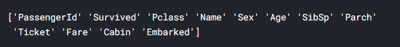

# 泰坦尼克号幸存者预测

## 概述—问题处理的流程

在竞赛过程中，处理问题一般分为7个阶段：

```
1.确认竞赛题目问题的定义，即读题。

2.获取问题的训练和测试数据。

3.整理、预处理数据。

4.可视化分析数据，探索数据的意义。

5.建立模型，初步预测解决问题。

6.优化解决方案，记录问题解决步骤，生成最终解决方案。

7.提交结果。
```

工作流表示了阶段的顺序以及阶段需要解决的问题，在实际过程中可能不需要分这么细：

```
1.我们可以将多个阶段合并为一个阶段，比如我们可以通过可视化数据来分析数据。

2.我们可以将某个阶段提前或改变，比如我们可以在整理完数据之前和之后分析数据。

3.我们可以将某个步骤使用多次，比如我们可能多次使用可视化步骤。

4.我们也可以不执行某个步骤。
```

## 1.读题—确定问题的定义

像Kaggle这样的竞赛网站定义要解决的问题或要问的问题，同时提供训练数据集来训练模型，并根据测试数据集来测试模型结果。

本题是让我们使用机器学习方法来创建一个模型，用以预测哪些乘客在泰坦尼克号沉船事故中幸存下来。题目定义如下：

```
The competition is simple: use machine learning to create a model that predicts which passengers survived the Titanic shipwreck.
```

同时，在介绍题目背景时，我们可以从中找到一些对于处理题目或许有用的信息。背景介绍如下：

```
The sinking of the Titanic is one of the most infamous shipwrecks in history.

On April 15, 1912, during her maiden voyage, the widely considered “unsinkable” RMS Titanic sank after colliding with an iceberg. Unfortunately, there weren’t enough lifeboats for everyone onboard, resulting in the death of 1502 out of 2224 passengers and crew.

While there was some element of luck involved in surviving, it seems some groups of people were more likely to survive than others.

In this challenge, we ask you to build a predictive model that answers the question: “what sorts of people were more likely to survive?” using passenger data (ie name, age, gender, socio-economic class, etc).
```

从中我们可以了解到：

```
1.在泰坦尼克号沉没之后，2224名乘客和船员中有1502名死亡，可计算出确凿的幸存率为（2224 - 1502）/ 2224 = 32.4%。

2.幸存率比较低的原因是船上的救生艇是有限的。

3.尽管幸存下来会有运气的成分，但明显一部分人会比其他人幸存的机会大，比如妇女儿童或者上层社会阶级的人，这是很直观的。
```

## 2.处理数据—数据分析

我们在数据分析阶段主要解决7个主要问题：

```
1.分类。我们可能需要对样本数据进行分类。我们可能还想了解不同类与解决方案目标之间的关系。

2.相关性。我们可以根据训练数据集中的可用特征来解决这个问题。数据集中的哪些特性对我们的解决方案目标有重大贡献？从统计学上讲，特征和解决方案目标之间是否存在相关性？随着特征值的变化，解决方案的状态是否也发生变化，反之亦然？这可以测试给定数据集中的数值特征和分类特征。我们可能还想确定特征之间的相关性，将某些特征关联起来可能有助于接下来更好地处理数据。

3.特征转换。在建模阶段，需要准备数据， 根据模型算法的选择，可能需要将所有特征都转换为数值等效值。 例如将分类字符串形式值转换为数字值。

4.处理缺失数据。数据准备也可能要求我们估计一个特征中的缺失值。因为当不存在缺失值时，模型算法可能效果最好。

5.修正数据。我们还可以分析给定的训练数据集中的错误或可能不正确的数据，并尝试更正这些值或排除包含错误的样本。一种方法是检测样本或特征中的异常值，如果某个特性对分析没有帮助，或者可能会显著地扭曲结果，我们也可能会完全丢弃它。

6.创建新特征。我们是否可以基于现有特性或一组特性来创建新特性，以便新特性遵循相关性、转换和完整性目标（2，3，4）。

7.制图。如何根据数据的性质以及为了目标解决方案选择正确的可视化绘图和图表。
```

在具体解决问题时，建议：

```
1.在项目前期进行特征相关性分析。
2.使用多个图代替覆盖图以提高可读性。
```

下面开始正式代码实践了，首先加载可能会用到的头文件：

```
# data analysis and wrangling
import pandas as pd
import numpy as np
import random as rnd

# visualization
import seaborn as sns
import matplotlib.pyplot as plt
%matplotlib inline

# machine learning
from sklearn.linear_model import LogisticRegression
from sklearn.svm import SVC, LinearSVC
from sklearn.ensemble import RandomForestClassifier
from sklearn.neighbors import KNeighborsClassifier
from sklearn.naive_bayes import GaussianNB
from sklearn.linear_model import Perceptron
from sklearn.linear_model import SGDClassifier
from sklearn.tree import DecisionTreeClassifier
```

Python中的Pandas包能帮助我们处理数据，我们可以选择将训练和测试数据读入Pandas中的DataFrames来查看数据，我们也可以将数据合并起来一起查看：

```
# acquire data
train_df = pd.read_csv('./data/train.csv')
test_df = pd.read_csv('./data/test.csv')
combine = [train_df, test_df]
```

接下来，查看数据中的特征：

```
print(train_df.columns.values)
```

