#  泰坦尼克号幸存者预测

## 概述—问题处理的流程

在竞赛过程中，处理问题一般分为7个阶段：

```
1.确认竞赛题目问题的定义，即读题。

2.获取问题的训练和测试数据。

3.整理、预处理数据。

4.可视化分析数据，探索数据的意义。

5.建立模型，初步预测解决问题。

6.优化解决方案，记录问题解决步骤，生成最终解决方案。

7.提交结果。
```

工作流表示了阶段的顺序以及阶段需要解决的问题，在实际过程中可能不需要分这么细：

```
1.我们可以将多个阶段合并为一个阶段，比如我们可以通过可视化数据来分析数据。

2.我们可以将某个阶段提前或改变，比如我们可以在整理完数据之前和之后分析数据。

3.我们可以将某个步骤使用多次，比如我们可能多次使用可视化步骤。

4.我们也可以不执行某个步骤。
```

## 1.读题—确定问题的定义

像Kaggle这样的竞赛网站定义要解决的问题或要问的问题，同时提供训练数据集来训练模型，并根据测试数据集来测试模型结果。

本题是让我们使用机器学习方法来创建一个模型，用以预测哪些乘客在泰坦尼克号沉船事故中幸存下来。题目定义如下：

```
The competition is simple: use machine learning to create a model that predicts which passengers survived the Titanic shipwreck.
```

同时，在介绍题目背景时，我们可以从中找到一些对于处理题目或许有用的信息。背景介绍如下：

```
The sinking of the Titanic is one of the most infamous shipwrecks in history.

On April 15, 1912, during her maiden voyage, the widely considered “unsinkable” RMS Titanic sank after colliding with an iceberg. Unfortunately, there weren’t enough lifeboats for everyone onboard, resulting in the death of 1502 out of 2224 passengers and crew.

While there was some element of luck involved in surviving, it seems some groups of people were more likely to survive than others.

In this challenge, we ask you to build a predictive model that answers the question: “what sorts of people were more likely to survive?” using passenger data (ie name, age, gender, socio-economic class, etc).
```

从中我们可以了解到：

```
1.在泰坦尼克号沉没之后，2224名乘客和船员中有1502名死亡，可计算出确凿的幸存率为（2224 - 1502）/ 2224 = 32.4%。

2.幸存率比较低的原因是船上的救生艇是有限的。

3.尽管幸存下来会有运气的成分，但明显一部分人会比其他人幸存的机会大，比如妇女儿童或者上层社会阶级的人，这是很直观的。
```

## 2.处理数据—数据分析

### 2.1.通过数据比例分析数据

我们在数据分析阶段主要解决7个主要问题：

```
1.分类。我们可能需要对样本数据进行分类。我们可能还想了解不同类与解决方案目标之间的关系。

2.相关性。我们可以根据训练数据集中的可用特征来解决这个问题。数据集中的哪些特性对我们的解决方案目标有重大贡献？从统计学上讲，特征和解决方案目标之间是否存在相关性？随着特征值的变化，解决方案的状态是否也发生变化，反之亦然？这可以测试给定数据集中的数值特征和分类特征。我们可能还想确定特征之间的相关性，将某些特征关联起来可能有助于接下来更好地处理数据。

3.特征转换。在建模阶段，需要准备数据， 根据模型算法的选择，可能需要将所有特征都转换为数值等效值。 例如将分类字符串形式值转换为数字值。

4.处理缺失数据。数据准备也可能要求我们估计一个特征中的缺失值。因为当不存在缺失值时，模型算法可能效果最好。

5.修正数据。我们还可以分析给定的训练数据集中的错误或可能不正确的数据，并尝试更正这些值或排除包含错误的样本。一种方法是检测样本或特征中的异常值，如果某个特性对分析没有帮助，或者可能会显著地扭曲结果，我们也可能会完全丢弃它。

6.创建新特征。我们是否可以基于现有特性或一组特性来创建新特性，以便新特性遵循相关性、转换和完整性目标（2，3，4）。

7.制图。如何根据数据的性质以及为了目标解决方案选择正确的可视化绘图和图表。
```

在具体解决问题时，建议：

```
1.在项目前期进行特征相关性分析。
2.使用多个图代替覆盖图以提高可读性。
```

下面开始正式代码实践了，首先加载可能会用到的头文件：

```
# data analysis and wrangling
import pandas as pd
import numpy as np
import random as rnd

# visualization
import seaborn as sns
import matplotlib.pyplot as plt
%matplotlib inline

# machine learning
from sklearn.linear_model import LogisticRegression
from sklearn.svm import SVC, LinearSVC
from sklearn.ensemble import RandomForestClassifier
from sklearn.neighbors import KNeighborsClassifier
from sklearn.naive_bayes import GaussianNB
from sklearn.linear_model import Perceptron
from sklearn.linear_model import SGDClassifier
from sklearn.tree import DecisionTreeClassifier
```

Python中的Pandas包能帮助我们处理数据，我们可以选择将训练和测试数据读入Pandas中的DataFrames来查看数据，我们也可以将数据合并起来一起查看：

```
# acquire data
train_df = pd.read_csv('./data/train.csv')
test_df = pd.read_csv('./data/test.csv')
combine = [train_df, test_df]
```

接下来，查看数据中的特征：

```
print(train_df.columns.values)
```


查看前几行和后几行数据，对数据有个初步认识：

```
# preview the data
train_df.head()
```


```
train_df.tail()
```


探索特征值的性质,**有哪些特征的值是相对固定的？**也就是特征值是可分类的，拥有几个固定的取值？这些值将样本分为相似样本集。 在分类特征内，值是基于标称值、序数、比率还是区间？ 除其他外，这有助于我们选择合适的图表进行可视化。

```
在本题中，分类特征为Categorical: Survived, Sex, and Embarked. 其中取值是有序数的为Ordinal: Pclass.
```

同样，**有哪些特征的值是数值化的？**这些值随着样本不同而变化。在数值特征中，数值是离散的、连续的还是基于时间序列的？

```
在本题中，连续的数值特征为Continous: Age, Fare. 离散的数值特征为Discrete: SibSp, Parch.
```

**有哪些特征值是混合数据类型？**例特征值既有数字又有字母，或有些为数字有些为字母，这样的特征值可能不是正确的数据，也许需要修正。

```
在本题中，Ticket特征值是混合字母和字母数字类型的，Cabin特征值是字母数字类型的。
```

**有哪些特征值的数据可能是错误的？**如果面对较多数据集，判断出这一点难度很大，但是可以从其中某段较小数据集上的几个示例推测出有哪些特性可能需要更正。

```
在本题中，Name特征值可能存在错误，因为有多种方法用于描述这个特征，包括圆括号和用于替代或短名称的引号。
```

查看DataFrame的大致信息：

```
# pandas.DataFrame.info 打印DataFrame的简要摘要。
# 此方法显示有关DataFrame的信息，包括索引dtype和列，非空值和内存使用情况。
train_df.info()
print('_'*40)
test_df.info()
```


**有哪些特征值的数据是缺失的，有空值？**这些数据将需要被修正。

```
在本题中，在训练数据集中Cabin，Age，Embarked这三个特征的数据存在缺失，而且缺失程度为Cabin > Age > Embarked；在测试数据中Cabin，Age，Fare这三个特征的数据存在缺失，但Fare只有一个空值，可以先不考虑，那么缺失程度为Cabin > Age 
```

**特征值的数据类型情况是怎样的？**弄明白这一点对于后面特征值转化有帮助。

```
在本题中，在训练数据集中有七个特征是integer或floats类型的；在测试数据集中有六个特征是integer或floats类型的，有五个特征是strings类型的。
```

查看样本中数字特征值的分布：

```
"""
DataFrame.describe(percentiles=None, include=None, exclude=None, datetime_is_numeric=False) 生成描述性统计信息。
描述性统计包括总结数据集分布的集中趋势、离散度和形状的统计，不包括NaN(空)值。
分析数值和对象类型，以及混合数据类型的DataFrame列集，输出将根据参数而有所不同。
参数列表：
percentiles：
    描述要包含在输出中的百分比。 全部应介于0和1之间，默认值为[.25，.5，.75]，它返回第25、50和75个百分位数。
include:
    参数为结果中要包含的数据类型白名单。默认输出数值类型的统计情况；‘all’输出所有情况；['O']输出所有字符串类型情况，注意这是大写的o。还有其他参数值，要用的时候查看文档。
exclude：
    参数为要从结果中忽略的数据类型黑名单。默认不忽略任何特征值情况。
datetime_is_numeric：
    是否将日期时间数据类型视为数字。默认情况下为False，若为日期参数值为True。

"""
train_df.describe()
# Review survived rate using `percentiles=[.61, .62]` knowing our problem description mentions 38% survival rate.
# Review Parch distribution using `percentiles=[.75, .8]`
# SibSp distribution `[.68, .69]`
# Age and Fare `[.1, .2, .3, .4, .5, .6, .7, .8, .9, .99]`
```


分析数据的分布有助于我们了解训练数据集中一些重要的东西：

```
在本题中，通过设置不同的参数，我们可以得到如下结论：
1.样本总数为891，即泰坦尼克号（2224）上实际乘客人数的40%。
2.Survived是否幸存是用0或1表示的分类特征。
3.训练数据中约有38％的样本存活下来，代表了实际存活率的32％。
4.大多数乘客（> 75％）没有和父母或孩子一起旅行。
5.将近30％的乘客有兄弟姐妹或配偶。
6.票价差异很大，只有极少的乘客（<1％）支付的费用高达512美元。
7.65-80岁年龄段的老年乘客很少（<1％）。
```

查看样本中对象object特征值的分布

```
train_df.describe(include=['O'])
```


我们可以得到分类特征的分布信息：

```
1.Name在数据集中是唯一的（count = unique = 891）
2.Sex变量有两个可能的值，其中男性占65％（top=男性，freq = 577 / count = 891）。
3.Cabin在样本中具有多个重复项，可能几个乘客共用一个客舱。
4.Embarked拥有三个可能的值，大多数乘客使用的S港口（top= S）。
5.Ticket具有很高的重复值比率约22％，（unique= 681）。
```

基于到目前为止完成的数据分析，我们可以得出以下假设，在采取适当措施之前，我们可能会进一步验证这些假设：

```
1.相关性。
	我们想知道每个特征与生存率的关联程度，我们希望在项目的早期进行此操作，并将这些相关性与项目后期的建模相关性进行匹配。
2.完整性。
	1)我们可能想使得Age特征的数据完整，因为这个特征一定与生存率相关。
	2)我们可能想使得Embarked特征的数据完整，因为它也可能与生存或其他重要特征相关。
3.可能修正的数据。
	1）Ticket特征可能会从我们的分析中删除，因为它包含很高的重复率（22%），而且票号和存活率之间可能没有相关性。
	2）Cabin特征可能由于其数据高度不完整而被删除，在训练和测试数据集中此特征数据包含许多空值。
	3）PassengerId可能会从训练数据集中删除，因为它看起来和生存率毫无关系。
	4）Name特征数据不是很规范，可能不会直接有助于生存率，因此可能会被放弃。
4.创建新的特征。
	1）我们可能想基于Parch和SibSp这两个特征创建一个称为“Family”的新特征，以获取船上家庭成员的总数。
	2）我们可能要重新设计Name特征，将Title提取为新功能。
	3）我们可能要以年龄段Age bands创建新特征，这会将连续的年龄数字特征转换为序数形式的分类特征。
	4）我们可能还想创建一个票价范围Fare range特性，如果这助于我们的分析。
5.分类地考虑。
	我们也可以根据前面提到的问题描述增加假设。
	1）女性(Sex=female) 将更可能幸存。
	2）儿童(Age<?) 将更可能幸存。
	3）上层阶级乘客(Pclass=1) 将更可能幸存。
```

为了证实我们的一些观察和假设，下面通过关联特征来快速分析我们的特征相关性。我们只能在这个阶段对没有任何空值的特征这样做，对于分类（Sex）、序数（Pclass）或离散（SibSp，Parch）类型的特征，这样做也是有意义的。

```
"""
DataFrame.groupby(参数有很多,详细见官方文档),
使用映射器或按列对DataFrame进行分组。
['Pclass']:
    按照Pclass列分组
as_index=False:
    对于聚合输出，返回带有组标签的对象作为索引,也就是返回的数据带标签
mean():
    返回所请求轴的值的平均值
sort_values:
    按给定映射器或列排序
"""
train_df[['Pclass', 'Survived']].groupby(['Pclass'], as_index=False).mean().sort_values(by='Survived', ascending=False)
```

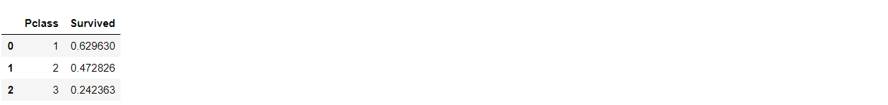

```
train_df[['Sex', 'Survived']].groupby(['Sex'], as_index=False).mean().sort_values(by='Survived', ascending=False)
```

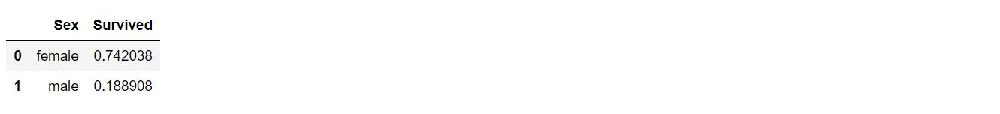

```
train_df[["SibSp", "Survived"]].groupby(['SibSp'], as_index=False).mean().sort_values(by='Survived', ascending=False)
```

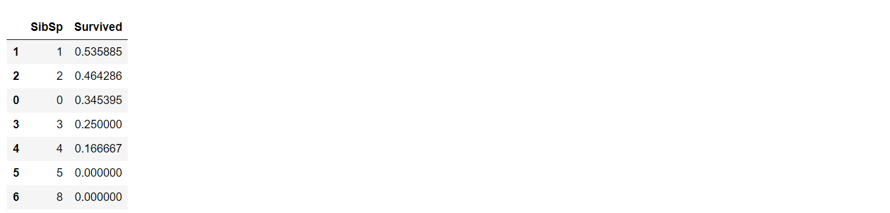

```
train_df[["Parch", "Survived"]].groupby(['Parch'], as_index=False).mean().sort_values(by='Survived', ascending=False)
```

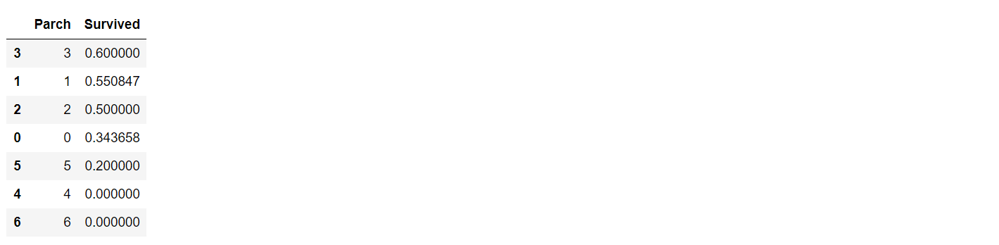

 由上面的分析，我们可知：

```
1.Pclass阶级特征：可以观察到Pclass=1与幸存极具相关性（其中有6成的人幸存）。
2.Sex性别特征：可以观察得Sex=female，即性别为女性的存活率非常高（>74%）
3.SibSp and Parch亲人特征：这些特征貌似与是否幸存没有多大关系。 可能需要从这些独立的特征中派生一个特征或一组特征。
```

### 2.2.通过可视化分析数据

接下来，我们会通过可视化分析数据来继续证实之前的假设。

我们首先从理解数字型特征和目标特征间的关系开始。**直方图可用于分析连续的数字变量**，例如"Age"，其中带状或范围将有助于识别有用的模式，直方图可以自定义等距范围来指示样本的分布，这有助于我们回答与特定范围有关的问题（例如婴儿的存活率更高吗？）

```
"""
Seaborn是基于matplotlib的Python可视化库，比matplotlib更加容易使用，而且图例的风格更加现代化
"""
g = sns.FacetGrid(train_df, col='Survived') # 创建网格并将训练数据的'Survived'特征作为高度
g.map(plt.hist, 'Age', bins=20) # 绘制图像,hist为直方图,横坐标为'Age',分布间隔为20
```

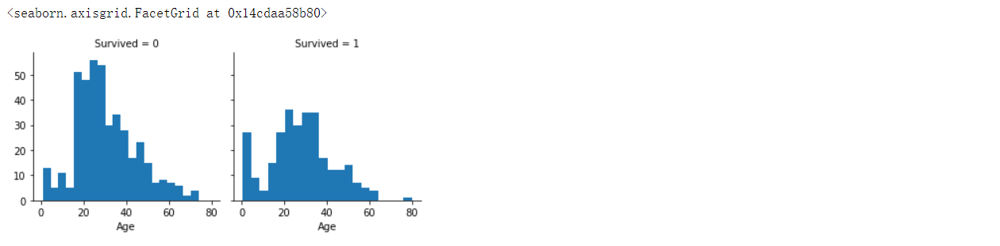

通过以上图像，我们可以得到如下结论：

```
1.初生婴儿（Age<=4）有较高的生存率。
2.老人（Age>=80）全部存活。
3.大部分15~25岁的年轻人没有存活。
4.绝大数乘客的年龄在15~35岁之间。
```

这种简单的分析证实了我们的假设，可为后续工作流程提供决策：

```
1.我们应该将Age特征考虑进我们的模型训练之中（分类假设2）。
2.我们应该使得Age特征值完整，没有空值（完整性假设1）。
3.我们应该以年龄段为基础将样本划分（创建新的假设3）。
```

我们可以组合多个特征在单个图中显示，以此来观察相关性，这可以通过具有数字值的数字和分类特征来完成。

```
grid = sns.FacetGrid(train_df, col='Pclass', hue='Survived') # 将这两个特征关联起来显示在图中
grid.map(plt.hist, 'Age', alpha=.5, bins=20) # alpha表示透明度，越小越透明
grid.add_legend()
```

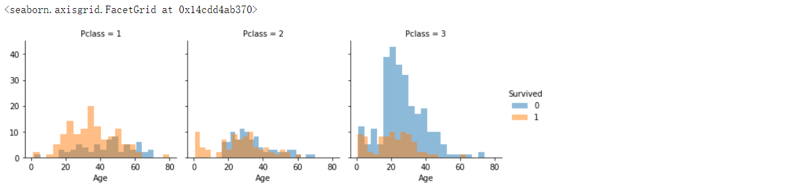

```
grid = sns.FacetGrid(train_df, col='Survived', row='Pclass', size=2.2, aspect=1.6) # size大小和aspect长宽比
grid.map(plt.hist, 'Age', alpha=.5, bins=20) # alpha表示透明度，越小越透明
grid.add_legend()
```

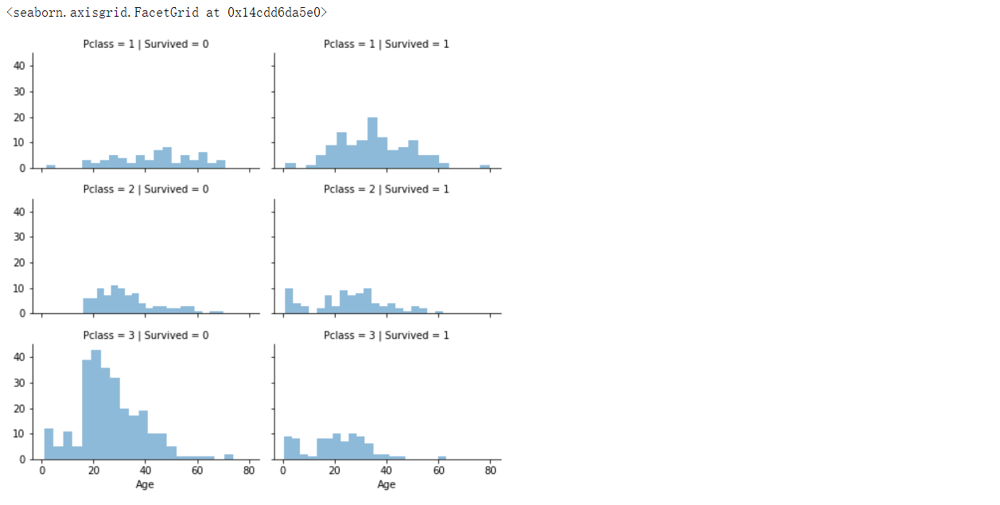

```
通过观察，我们可知：
1.大多数乘客的Pclass=3，然而他们的幸存率很低（这证实了我们的分类假设3）。
2.Pclass=2和Pclass=3的婴儿乘客大部分幸存下来（进一步证明我们的分类假设2）。
3.Pclass=1的大多数乘客幸存了下来（这进一步证实了我们的分类假设3）
4.Pclass在乘客的年龄分布方面有所不同。
由此，应该考虑将Pclass特征添加到模型训练中。 
```

现在，我们可以将分类特征与我们的解决目标Survived特征相关联。

```
grid = sns.FacetGrid(train_df, row='Embarked', size=2.2, aspect=1.6)
# palette参数，一般在使用hue时来改变线的颜色，有这几种系统给的可选deep, muted, bright, pastel, dark, colorb
grid.map(sns.pointplot, 'Pclass', 'Survived', 'Sex', palette='deep') # pointplot 点图
grid.add_legend()
```

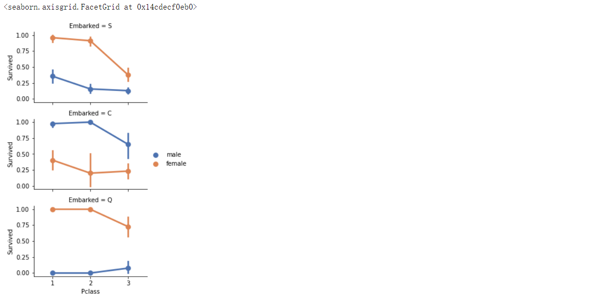

```
grid = sns.FacetGrid(train_df, col='Embarked')
# palette参数，一般在使用hue时来改变线的颜色，有这几种系统给的可选deep, muted, bright, pastel, dark, colorb
grid.map(sns.pointplot, 'Pclass', 'Survived', 'Sex', palette='deep') # pointplot 点图
grid.add_legend()
```

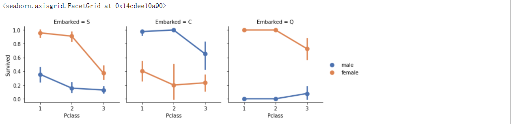

```
通过观察，我们可知：
1.女性的生存率比男性的生存率高（证实了分类假设1）。
2.在港口C是例外，那里男性的生存率比女性的高。这可能是Pclass与Embarked之间的存在关联，而Pclass与Survived关联从而影响了结果，不一定是Embarked与Survived之间直接关联。
3.在Q港口中，Pclass = 3的雄性成活率比Pclass = 2更高（完成假设2）。
4.各港口在Pclass = 3处男性乘客的生存率各不相同（相关性假设1）。
由此可见Sex与Embarked特征会影响目标值，我们决定:
1.将性别特征Sex添加到训练模型中。
2.将Embarked补全，并将Embarked特征添加到训练模型中。
```

我们可能还想将分类特征（具有非数字值）和数字特征联系起来分析，我们可以考虑将Embarked （类别为非数字），Sex （类别为非数字），Fare （类别为连续的数字）与Survived （类别数字）关联起来分析：

```
grid = sns.FacetGrid(train_df, row='Embarked', col='Survived', size=2.2, aspect=1.6)
# ci:回归估计的置信区间的大小。这将使用回归线周围的半透明带绘制。置信区间是使用bootstrap估计的；对于大型数据集，建议通过将此参数设置为None来避免这种计算。
grid.map(sns.barplot, 'Sex', 'Fare', alpha=.5, ci=None) # barplot 绘制条形图
grid.add_legend()
```

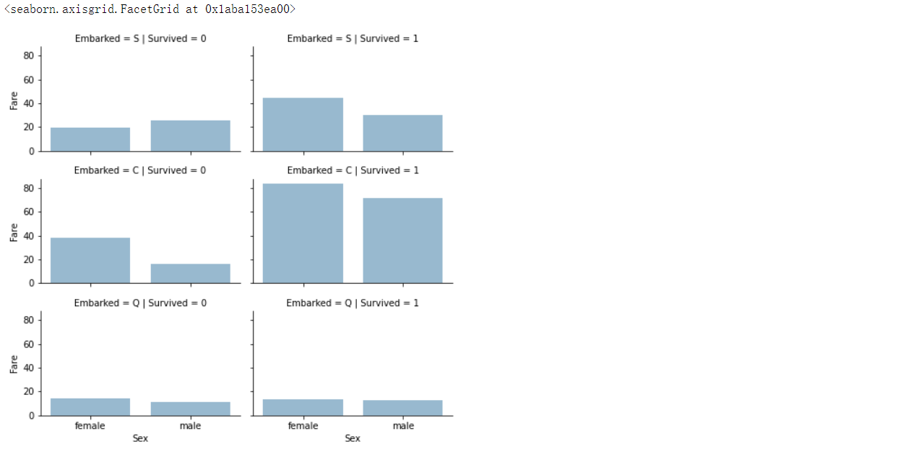

```
grid = sns.FacetGrid(train_df, col='Embarked', hue='Survived', palette='deep')
grid.map(sns.barplot, 'Sex', 'Fare', alpha=.5, ci=None) # barplot 绘制条形图
grid.add_legend()
```

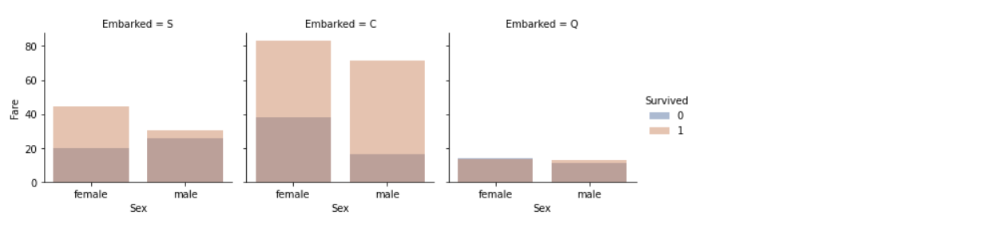

```
通过观察可知：
1.较高票价的乘客有更好的生存，确认我们关于创建票价范围的假设。
2.登船口与存活率相关。
由此，将Fare票价考虑进训练模型。
```

### 2.3.整理数据